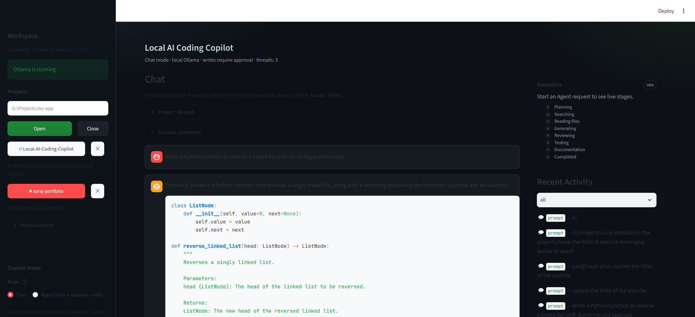
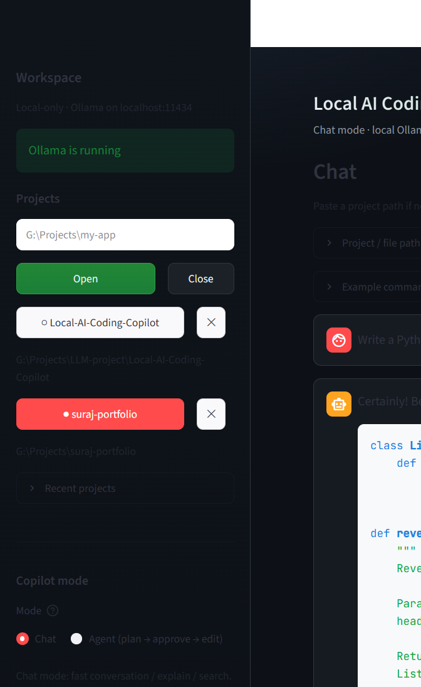
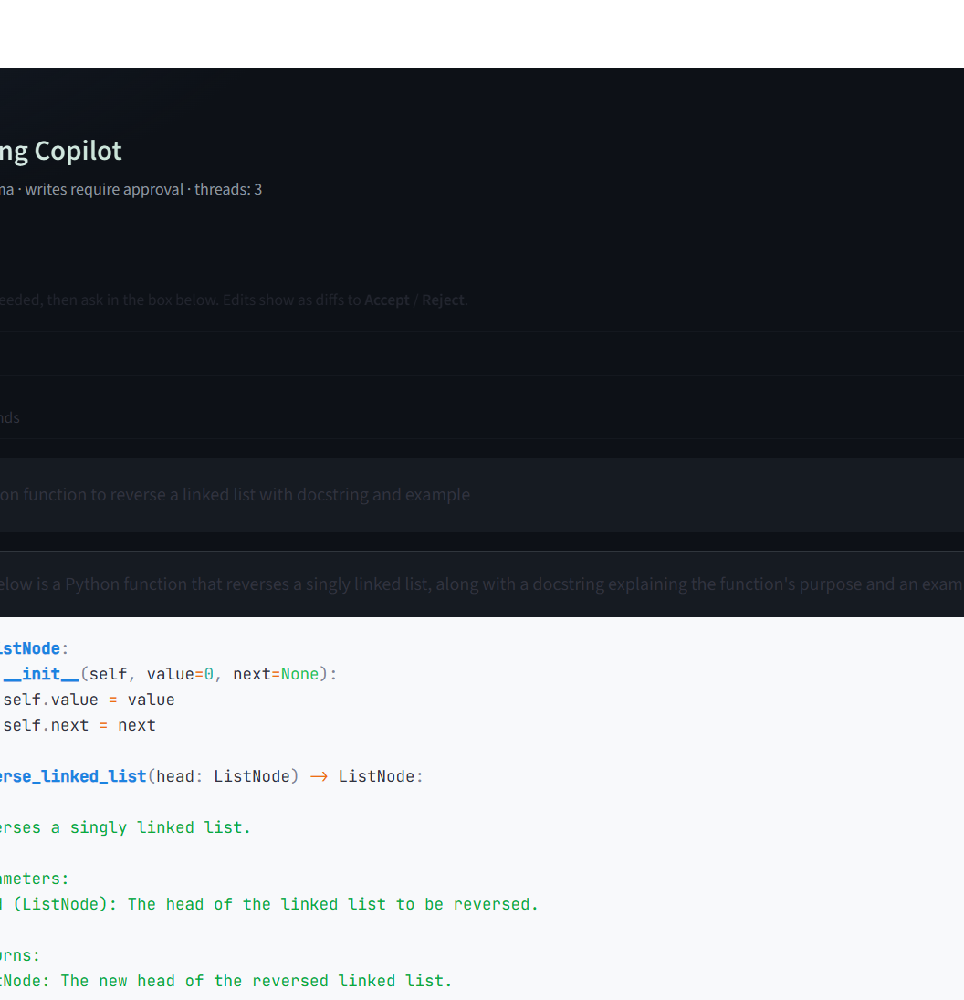
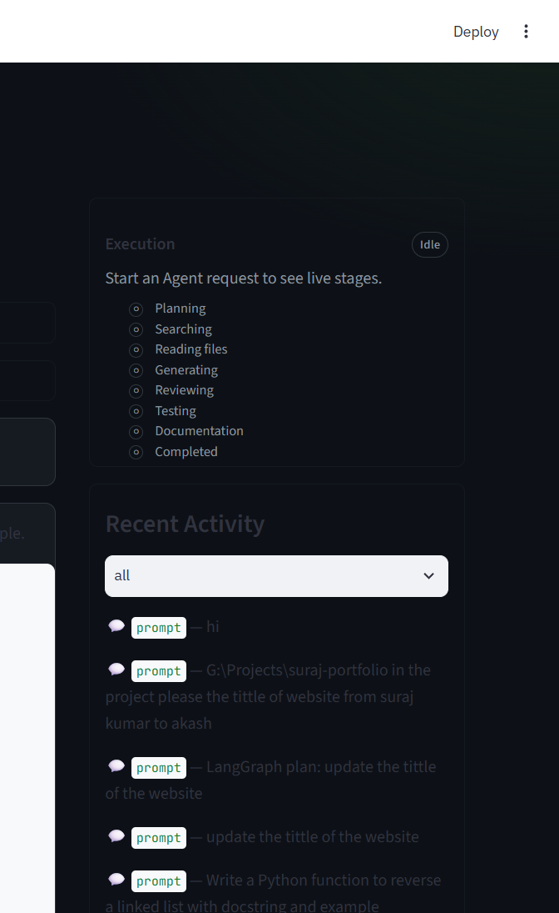

# Local AI Coding Copilot

A **local-first** AI coding assistant — like Cursor / Copilot, but everything runs on your laptop via [Ollama](https://ollama.com). No cloud API keys. You ask in chat; the app proposes **diffs**; you **Accept** or **Reject** before anything is written to disk.



**Repo:** https://github.com/Surajk111000/LocalAI-Copilot

---

## Table of contents

- [Clone this project](#clone-this-project)
- [Quick start](#quick-start)
- [Features (with screenshots)](#features-with-screenshots)
- [Architecture](#architecture)
- [Example commands](#example-commands)
- [Project layout](#project-layout)
- [Docs](#docs)
- [License](#license)

---

## Clone this project

### Prerequisites

- **Git**
- **Python 3.10+**
- **[Ollama](https://ollama.com)** installed and running
- ~8–16 GB RAM (16 GB recommended)
- Optional: NVIDIA GPU (GTX 1050 4GB works with `qwen2.5-coder:3b`)

### 1. Clone the repository

```bash
git clone https://github.com/Surajk111000/LocalAI-Copilot.git
cd LocalAI-Copilot
```

### 2. Create a virtual environment and install deps

**Windows (PowerShell):**

```powershell
python -m venv .venv
.\.venv\Scripts\activate
pip install -r requirements.txt
```

**macOS / Linux:**

```bash
python3 -m venv .venv
source .venv/bin/activate
pip install -r requirements.txt
```

### 3. Install Ollama models

```bash
ollama pull qwen2.5-coder:3b
ollama pull nomic-embed-text
```

### 4. Run the app

```bash
streamlit run ui/streamlit_app.py
```

Open **http://localhost:8501** in your browser.

---

## Quick start (after clone)

1. Open a project folder in the sidebar (or paste a path in **Project / file path**).
2. Choose **Chat** (fast) or **Agent** (plan → approve → edit).
3. Set **CPU usage** to **Eco** or **Low** if your laptop feels slow.
4. Type a task, click **Send**.
5. When edits appear, review the **diff** and click **Accept** (writes to disk) or **Reject**.

---

## Features (with screenshots)

### 1. Multi-project workspace

Open and switch between local folders. Recent projects stay one click away. Ollama connection status is shown in the sidebar.



**What you can do**

- Open any local folder (e.g. `G:\Projects\my-app`)
- Switch active project without restarting
- Keep several projects listed at once

---

### 2. Chat mode — local coding assistant

Ask coding questions and get runnable code from a local model (`qwen2.5-coder:3b` by default). Streaming replies. **Send** and **Stop** sit on one line under the chat.



**What you can do**

- Generate functions, APIs, Dockerfiles, explanations
- Paste a **file or folder path** so the AI works on *your* code
- Use example command buttons for common tasks

---

### 3. Agent mode — plan → approve → edit

LangGraph multi-agent pipeline:

`Planner → Research → Analyzer → Coder → Reviewer → Tester → Docs → Final`

The run **pauses after Planning** so you can Approve or Reject before more work continues. Nothing is written until you Accept diffs.

---

### 4. Execution panel (live stages)

See agent progress: Planning, Searching, Reading files, Generating, Reviewing, Testing, Documentation, Completed — plus recent activity.



---

### 5. Cursor-style diffs (Accept / Reject)

When the assistant changes code, you get a **proposed edit** (diff). You review it, then:

- **Accept** → write to disk (+ version history for undo)
- **Reject** → discard

Writes are **never** auto-applied.

**Text replace assist:** prompts like  
`G:\Projects\my-app change title from Suraj Kumar to Akash`  
search the project and propose multi-file diffs for review.

---

### 6. CPU usage controls (laptop-friendly)

Tune how hard Ollama uses the CPU so Windows + the UI stay responsive:

| Preset | Effect |
|--------|--------|
| **Eco (1)** | Least CPU, smoothest UI |
| **Low (2)** | Good if the laptop feels laggy |
| **Balanced** | Default middle ground |
| **Max safe** | Fastest answers, heavier CPU |

Also includes **CPU safety**: auto-pause AI work if CPU/RAM spike too high, with Unlock in the sidebar.


---

### 7. Project / file path tools

Expand **Project / file path** to:

- Paste a folder or single file
- **Explain folder** / **Explain file**
- **Set active project**

Expand **Example commands** for one-click prompts (list files, create file, add endpoint, …).

---

### 8. Filesystem tools & RAG (optional)

- **Tools:** list / read / search / propose writes (sandboxed to the project)
- **RAG:** index a project with `nomic-embed-text` + ChromaDB under `memory/` (gitignored)
- Answers can cite which files were used

---

### 9. Local-only by design

| Stays on your PC | What GitHub hosts |
|------------------|-------------------|
| Ollama models | Source code + docs |
| `memory/` indexes | Screenshots / README |
| Your project files | Config examples |

The app talks to `http://localhost:11434` only.

---

## Architecture

```text
You → Streamlit UI (localhost:8501)
        ├── Chat mode (fast Q&A / file edits / replace assist)
        └── Agent mode → LangGraph multi-agent
              Planner → Research → Analyzer → Coder
                → Reviewer → Tester → Docs → Final
              (interrupt after Planner for approval)
              Tools: filesystem | git | terminal | RAG
              Diff Accept/Reject → disk write
              memory/projects/<id>/…
```

---

## Example commands

```text
List the project files and explain the folder structure
Read src/config.py and explain what each setting does
Search for OllamaClient
Create examples/hello.py with a hello_world() function
Add a /health endpoint
G:\Projects\my-app change title from Old Name to New Name
Explain this project
```

---

## Project layout

```text
LocalAI-Copilot/
├── config/
│   ├── config.yaml
│   └── config.example.yaml
├── docs/
│   ├── screenshots/          # README images
│   ├── ARCHITECTURE.md
│   ├── INSTALLATION.md
│   └── DEVELOPER.md
├── src/
│   ├── agents/               # tool-calling agent
│   ├── editing/              # diffs, replace assist
│   ├── llm/                  # Ollama client
│   ├── multi_agent/          # LangGraph pipeline
│   ├── rag/                  # chunk / embed / retrieve
│   ├── tools/                # filesystem, git, terminal
│   └── workspace/            # projects, settings, paths
├── ui/
│   ├── streamlit_app.py      # main UI entry
│   └── components/
├── tests/
├── requirements.txt
└── README.md
```

---

## Docs

- [Architecture](docs/ARCHITECTURE.md)
- [Installation](docs/INSTALLATION.md)
- [Developer guide](docs/DEVELOPER.md)
- [Contributing](CONTRIBUTING.md)

---

## Troubleshooting

| Problem | Fix |
|--------|-----|
| `Ollama is not running` | Start the Ollama app, then `ollama pull qwen2.5-coder:3b` |
| UI feels laggy | Sidebar → **CPU usage** → **Eco** or **Low** |
| AI paused / locked | Sidebar → **CPU safety** → **Unlock** |
| Import errors after update | Restart Streamlit (Ctrl+C, then `streamlit run …` again) |
| Edits not applied | Look for the **diff** panel and click **Accept** |

---

## License

MIT — see [LICENSE](LICENSE).
